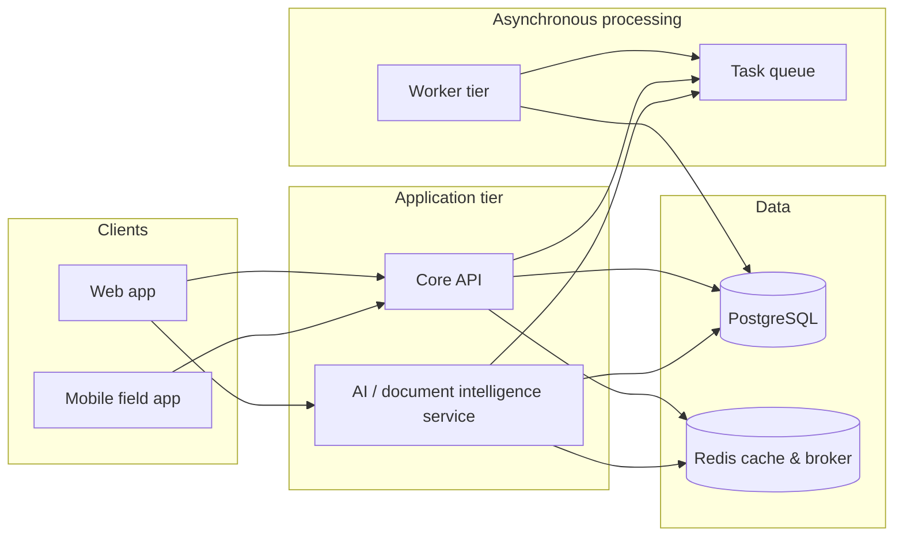

# Intelligent Operations Platform (Portfolio Overview)

---

## 1. Project Overview

**Intelligent Operations Platform** is a multi-tenant operations platform aimed at subcontractors and fabricators who run complex jobs from bid through production, logistics, and billing. It connects estimating, shop and yard execution, field coordination, and finance so teams work from one system instead of fragmented spreadsheets and point tools. The product is designed for both **single-company deployments** and **SaaS-style multi-tenant** use, with emphasis on **Windows-friendly local dev** and containerized services for consistent onboarding.

---

## 2. My Role

**Sole architect, product designer, and developer.**

That means I owned the product narrative and scope, translated operating reality into a modular platform design, wrote the technical specs and phase plans engineers could execute against, implemented the stack end-to-end (services, data model direction, web and automation layers), and iterated using self-directed research plus structured "phase" delivery with explicit verification gates—not ad-hoc coding.

---

## 3. Architecture Overview

### System diagram (logical)

### Core components (one sentence each)

| Component | Purpose |
|-----------|---------|
| **Web application** | Primary UX for office roles: projects, documents, estimating aids, configuration, and operational dashboards. |
| **Core API** | Tenant-aware business APIs, authentication integration, workflow modules, and structured exports. |
| **AI service** | Document understanding and semantic search helpers that augment human estimating and document-heavy workflows. |
| **Worker tier** | Background execution for long-running jobs (document processing, exports, notifications) without blocking users. |
| **Relational database** | System of record with strong consistency for financial and operational entities. |
| **Cache & queue** | Session-scale caching, rate-friendly patterns, and reliable asynchronous handoff between services. |
| **Observability** | Health checks, metrics, and tracing hooks so reliability issues are visible before users report them. |
| **Field mobile client** | Supervisor-oriented workflows with offline-first assumptions for real job-site conditions. |

---

## 4. Key Product Decisions

**Decision:** **Row-level, database-backed tenant isolation** as the default posture for SaaS-scale trust.  
**Why:** Customers expect proof that data cannot leak across tenants; pushing isolation closer to the data layer reduces whole classes of application bugs and simplifies compliance conversations.

**Decision:** **Split the AI workload into a dedicated service** alongside the core API.  
**Why:** ML dependencies, CPU/GPU contention, and release cadence differ from core CRUD and finance flows; separation improves resilience and lets the AI plane evolve without destabilizing transactional workloads.

**Decision:** **Hybrid retrieval (semantic + lexical)** for knowledge surfacing, not "vector-only."  
**Why:** Construction paperwork mixes exact identifiers and fuzzy language; combining approaches improves recall and robustness when embeddings or corpora are imperfect.

**Decision:** **Prioritize local / portable inference (e.g., ONNX-class deployment paths)** for OCR and embeddings where feasible.  
**Why:** Lowers marginal cloud cost, reduces data egress sensitivity, and suits on-prem or hybrid buyers who cannot send every drawing to a third-party model API.

**Decision:** **Explicit asynchronous jobs** for heavy pipelines (documents, exports, notifications).  
**Why:** Users need responsive UIs; long work must not tie up request threads. A queue-backed worker model is a standard, scalable pattern for this class of product.

**Decision:** **Modern web stack with strong typing and component primitives** for the primary UI.  
**Why:** Faster iteration for complex tables and workflows, fewer runtime surprises in large forms, and easier hiring/onboarding for frontend contributors.

**Decision:** **Offline-first assumptions for field workflows** (including dedicated mobile direction).  
**Why:** Connectivity and time pressure on site beat ideal SaaS assumptions; syncing and conflict strategy are product requirements, not nice-to-haves.

**Decision:** **Phase-gated delivery with mandatory verification** (not a single monolithic release).  
**Why:** ERP surface area is huge; phased scope with "how we prove it works" controls rework and keeps an individual contributor accountable to measurable progress.

---

## 5. Technical Stack

| Layer | Technology (representative) |
|--------|-----------------------------|
| **Frontend** | Next.js, React, TypeScript, Tailwind CSS, component primitives, client state and data-fetch libraries |
| **Backend** | Python, FastAPI, Pydantic, SQLAlchemy, Alembic migrations |
| **Database** | PostgreSQL (including vector-ready extensions where enabled), Redis for cache and messaging |
| **AI / ML** | OCR for drawings and PDFs; text embeddings; hybrid retrieval; ONNX-style runtime for deployable models |
| **Async & automation** | Celery-style worker processes, workflow scheduling, monitoring tools for queue visibility |
| **Mobile** | Expo / React Native (field supervisor workflows; offline sync emphasis) |
| **Infrastructure** | Docker Compose for local multi-service dev, PowerShell-first ergonomics on Windows, deployment packaging under a dedicated deploy area |
| **Testing** | pytest for backend, browser-based E2E tests, front-end unit tooling, consolidated QA reporting for regression confidence |

---

## 6. AI & Intelligent Features

**Problems addressed for users**

- **Turn unstructured job documents into actionable context** (drawings, specs, PDFs) so estimators and PMs spend less time re-keying and hunting for references.
- **Make institutional knowledge searchable in the flow of work** so answers surface where users already are—not only in a separate document store.
- **Assist (not replace) specialized roles** with suggestions tied to project context, with human review as the default expectation for high-stakes outputs.

**Approaches (categories, not implementations)**

- **OCR / layout-aware extraction** to recover text and structure from scans and digital prints.
- **Dense text embeddings** for semantic similarity and grouping.
- **Retrieval-augmented workflows** combining keyword-style and embedding-style signals so answers cite relevant context.
- **Copilot-style assistance** positioned at product seams (e.g., estimating, detailing, customer-facing narratives) with role and scope awareness called out in the architecture—not as a single monolithic chat bolt-on.

**Workflow fit**

Intelligence is embedded **at the moment documents and estimates are produced and reviewed**, so the user's path remains: ingest → understand → decide → record—not "chat first, work second."

---

## 7. Product Development Methodology

**Phases and iterations**

Delivery is organized as **numbered phases** spanning foundational platform work, domain modules (time, billing, scheduling, vendor/AP themes, exports, etc.), AI document understanding, UX modernization, integration fabric, and enterprise hardening (security, audit, multi-tenant operations, documentation integrity).

**How scope was chosen**

Each phase follows a recurring discipline: **inputs → actions → verification → commit narrative**, so scope is bounded and completeness is defined by tests and checks—not by intuition alone.

**Progression**

1. **Foundation** — services, auth direction, tenant posture, baseline data modeling.  
2. **Core operational modules** — operational/finance primitives that prove the domain model.  
3. **AI layer** — document intelligence and search that amplifies existing screens.  
4. **Experience and ergonomics** — design-system-level UI coherence for heavy workflows.  
5. **Enterprise readiness** — security, observability, backup/restore thinking, and QA consolidation.  
6. **Continuous refinement** — performance, caching, and developer velocity items carried as explicit roadmap threads.

**QA and validation**

Validation mixes **automated tests**, **integration checks**, **E2E user flows**, and **consolidated QA reporting** so regressions are visible early—aligned with a solo-owner reality where automation is the safety net.

---

## 8. Current Status

**✅ Complete**

- Multi-service architecture (web, API, AI service, workers) with containerized local orchestration
- Broad domain coverage across estimating, billing, scheduling, vendor/AP, exports, and related automation — delivered in numbered phases with verification gates
- AI-assisted document understanding and semantic search wired as product capabilities
- Security and compliance posture: auth, RBAC, audit logging, and multi-tenant RLS

**🔧 Paused — Refocused**

- Platform development paused to pursue a more targeted product (Estimator) that applies the same architecture patterns to a narrower, higher-leverage problem
- Remaining hardening work (environment parity, background processing reliability, production monitoring) is tracked but deferred intentionally

**📋 Future**

- Production SaaS concerns (billing, SSO, compliance packaging) at roadmap discretion
- Field/offline durability and performance optimization as usage scales

---

## 9. What This Project Demonstrates

- **End-to-end platform ownership** from product framing to running multi-service software.
- **Multi-tenant SaaS thinking** with an isolation strategy appropriate for regulated customer trust.
- **AI product integration**: pairing document ML and retrieval with real workflows rather than demo-grade chat.
- **Operational realism**: queues, workers, observability, and backups treated as first-class—not an afterthought.
- **Complex domain scoping** across estimating, production, field, and finance-adjacent concerns without collapsing them into a single brittle module.
- **Phased TPM-style execution**: scope packaging, dependency ordering, and explicit verification criteria.
- **Stakeholder-readable specifications**: architecture and security narratives that bridge engineering and business risk.
- **Dual distribution mindset** supporting professional local installs and hosted multi-tenant operation.

---

## Confidentiality

This README is safe for public or semi-public portfolios: **no proprietary prompts, pipeline internals, schemas, or business rules are disclosed.** For a deeper technical review under NDA, I can walk architecture and trade-offs live without sharing clone-ready artifacts.
